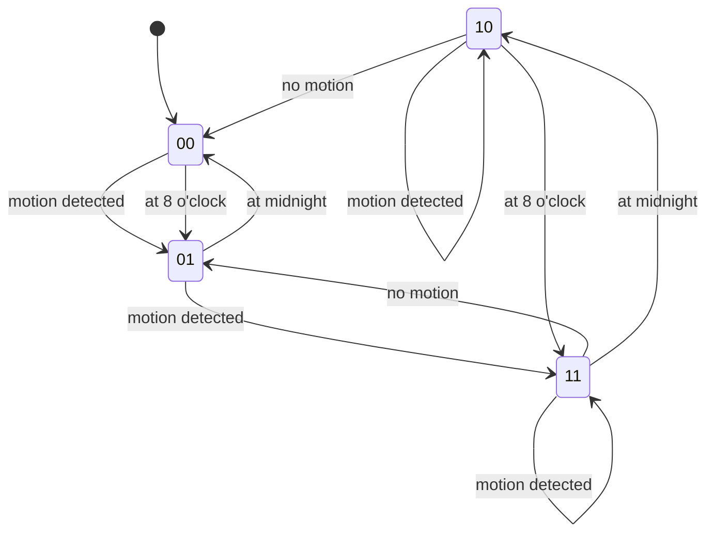

# basement automation

This document explains the basement automation flows.

## light

In previous iterrations i have had a few corner cases,
therefore I made use of a locking implementation to prevent unwanted/unexpected state transitions.

The main idea is to block any state transaction while lock is active, or refresh lock duration for n time on a motion event for example.

### entities

This table list all involved entities and the system they belong to:

| system          | entity                |
| --------------- | --------------------- |
| home-assistant  | group.motion_basement |
| home-assistant  | light.basement        |
| locking-service | basemente_light_on    |

### system-states

This table list all system states:

| state | light | time        |
| ----- | ----- | ----------- |
| 00    | off   | 00:00-08:00 |
| 01    | off   | 08:00-00:00 |
| 10    | on    | 00:00-08:00 |
| 11    | on    | 08:00-00:00 |

The following yaml is a simple explanation on how the state is encoded:

```yaml
state-encoding: |
  x   -> 1 = light is on, 0 = light is off
  . x -> 0 = 00:00-08:00, 01 = 08:00-00:00
```

### rules

These rules are the requirements, creating the base for our state mashine:

```yaml
- if: motion is on and light is off and time is between 00:00-08:00 local time
  system-state: 00
  then: switch light on for 5 min (lock)
```

```yaml
- if: motion is on and light is off and time is between 08:00-00:00 local time
  system-state: 01
  then: switch light on for 15m (lock)
```

```yaml
- if: motion is on and light is on and time is between 00:00-08:00 local time
  system-state: 10
  then: change on time to 5m from now (lock)
```

```yaml
- if: motion is on and light is on and time is between 08:00-00:00 local time
  system-state: 11
  then: change on time to 15m from now (lock)
```

```yaml
- if: lock has expired and motion is off and light is on
  system-state: 10 | 11
  then: turn light off
```

### transitions



### state mashine


