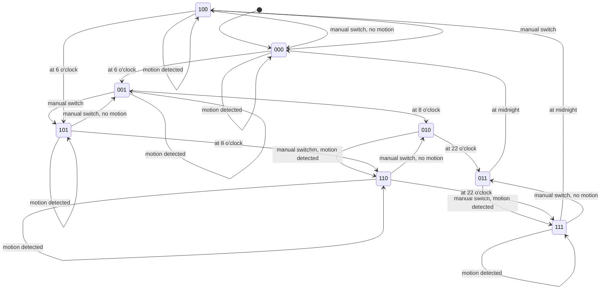

# office automation

This document explains the office automation flows.

## light

In previous iterrations i have had a few corner cases,
therefore I made use of a locking implementation to prevent unwanted/unexpected state transitions.

The main idea is to block any state transaction while lock is active, or refresh lock duration for n time on a motion event for example.

### entities

This table list all involved entities and the system they belong to:

| system          | entity                                                  |
| --------------- | ------------------------------------------------------- |
| home-assistant  | binary_sensor.mijia_motion_basement_stairs_up_occupancy |
| home-assistant  | binary_sensor.switch_office_touchpad                    |
| home-assistant  | group.motion_office                                     |
| home-assistant  | light.office                                            |
| locking-service | office_light_on                                         |

### system-states

This table list all system states:

| state | light | time        |
| ----- | ----- | ----------- |
| 000   | off   | 00:00-06:00 |
| 001   | off   | 06:00-08:00 |
| 010   | off   | 08:00-22:00 |
| 011   | off   | 22:00-00:00 |
| 100   | on    | 00:00-06:00 |
| 101   | on    | 06:00-08:00 |
| 110   | on    | 08:00-22:00 |
| 111   | on    | 22:00-00:00 |

The following yaml is a simple explanation on how the state is encoded:

```yaml
state-encoding: |
  x     -> 1 = light is on, 0 = light is off
  . x x -> 00 = 00:00-06:00, 01 = 06:00-08:00, 10 = 08:00-22:00, 11 = 22:00-00:00
```

### rules

These rules are the requirements, they create the base for our state mashine:

```yaml
- if: motion is on light is off and time is between 08:00-24:00
  system-state: 010 || 011
  then: switch light on for 30m (lock)
```

```yaml
- if: motion is on and light is on and time is between 08:00-24:00
  system-state: 110 || 111
  then: change on time to 30m from now (lock)
```

```yaml
- if: motion is on and light is off and time is between 24:00-08:00
  system-state: 000 || 001
  then: do nothing
```

```yaml
- if: motion is on and light is on and time is between 24:00-08:00
  system-state: 100 || 101
  then: change on time to 15m from now (lock)
```

```yaml
- if: wall switch touchpad is on (touchpad pressed) and light is off
  system-state: 000 || 001 || 010 || 011
  then: change on time to 1h (will be overriden by motion events)
```

```yaml
- if: wall switch touchpad is on (touchpad pressed) and light is on
  system-state: 100 || 111 || 101 || 110
  then: change off time to 1h (will ignore motion events for this time)
```

### transitions



### state mashine


